# Research Data Discovery Capabilities

This note tracks the services used by `pybman.discovery` to answer:

- Given a PuRe publication DOI, are there linked research datasets?
- Given an ORCID iD, are there public datasets by that researcher?
- Given a publication title and authors, is there a verifiable replication dataset?

The implementation is intentionally provider-based. Every provider returns a
`ProviderResult`; `DataDiscovery` merges and deduplicates `DatasetHit` objects
while preserving provider-level errors for auditability.

```mermaid
flowchart TD
    A["Input: DOI or ORCID"] --> B["Normalize identifier"]
    B --> C{"Identifier type"}
    C -->|DOI| D["DOI-capable providers"]
    C -->|ORCID| E["ORCID-capable providers"]
    D --> F["DataCite relatedIdentifiers"]
    D --> G["ScholeXplorer Scholix links"]
    D --> H["OpenAIRE dataset PID lookup"]
    D --> I["B2FIND full-text metadata search"]
    D --> J["Crossref supplement relations"]
    E --> K["DataCite creator nameIdentifiers"]
    E --> L["OpenAIRE authorOrcid datasets"]
    E --> M["B2FIND full-text metadata search"]
    E --> N["ORCID public data-set works"]
    F --> O["ProviderResult list"]
    G --> O
    H --> O
    I --> O
    J --> O
    K --> O
    L --> O
    M --> O
    N --> O
    O --> P["Deduplicated DiscoveryReport"]
    P --> Q["Google Dataset Search hand-off URL"]
```

## Capability Matrix

| Service | API status | DOI lookup | ORCID lookup | Strength | Limitations |
| --- | --- | --- | --- | --- | --- |
| DataCite REST API | Public JSON API at `https://api.datacite.org` | `GET /dois?query=relatedIdentifiers.relatedIdentifier:"<doi>"&resource-type-id=dataset` | `GET /dois?query=creators.nameIdentifiers.nameIdentifier:*<orcid>*&resource-type-id=dataset` | Best primary source for dataset DOIs and metadata links. | Only sees DataCite DOI metadata; publication links depend on deposited related identifiers. |
| OpenAIRE Graph API | Public JSON API at `https://api.openaire.eu/graph/v1` | `GET /researchProducts?pid=<doi>&type=dataset` checks whether the DOI itself is a dataset. | `GET /researchProducts?authorOrcid=<orcid>&type=dataset` | Strong aggregated ORCID-to-dataset coverage across repositories. | Publication DOI to linked datasets is better handled by ScholeXplorer. |
| ScholeXplorer API | Public JSON Scholix API at `https://api.scholexplorer.openaire.eu/v3` | `GET /Links?sourcePid=<doi>` and `GET /Links?targetPid=<doi>` | Not supported. | Purpose-built publication-dataset relationship graph. | No author/ORCID model; source service coverage can vary over time. |
| B2FIND / EUDAT | CKAN Action API at `https://b2find.eudat.eu/api/3/action/package_search` | Full-text phrase query for the DOI. | Full-text phrase query for the ORCID iD. | Useful European repository/catalogue coverage; simple anonymous API. | No dedicated DOI/ORCID fields, so precision depends on metadata text. |
| Crossref REST API | Public JSON API at `https://api.crossref.org` | `GET /works/<doi>` and inspect dataset-like supplement relations. | Not supported for datasets. | Good high-precision publisher-asserted supplement links. | Crossref mostly registers publications; DataCite DOIs often return 404 here. |
| ORCID Public API | Public JSON API at `https://pub.orcid.org/v3.0` | Not supported for publication-to-dataset discovery. | `GET /<orcid>/works` and filter public works with type `data-set`. | Direct view of public datasets claimed on the ORCID record. | Needs public ORCID works; record completeness is researcher/source dependent. |
| Google Dataset Search | No public search API. | Manual hand-off URL generated from the DOI. | Manual hand-off URL generated from the ORCID iD or researcher name. | Helpful final human check over schema.org/Dataset-indexed pages. | Cannot be integrated as a reliable automated provider. |
| OSF API v2 | Public JSON API at `https://api.osf.io/v2` | Not used for DOI relations. | Not used for ORCID lookup. | Finds public OSF projects and registrations by title, including records without a DOI. | Candidates are only accepted after strong title and contributor matching. |
| Europe PMC REST API | Public JSON/XML API at `https://www.ebi.ac.uk/europepmc/webservices/rest` | Resolves a DOI to OA full text and extracts explicit repository links from data-availability sections; GitHub targets receive an additional repository-tree data-file audit. | Not supported. | Direct article-level evidence from the published data-availability statement. | Limited to the Europe PMC full-text corpus; future-release promises and code-only repositories are excluded. |
| PuRe full text and attachments | Public PuRe item/file APIs plus PDF text and annotation extraction. | Reads explicit data-availability statements, repository URLs, and structured supplementary files from the maintained PuRe record. | Not supported. | Uses the institutionally maintained publication context and can recover links omitted from DOI metadata. | Only public files are inspected; request-only statements and future promises are excluded. |
| AEA Data and Code | Publisher article page plus the linked openICPSR deposit. | Resolves publisher-maintained `Data and Code` links to their ICPSR DOI. | Not supported. | High-precision publisher assertion for economics replication packages. | Limited to AEA publications that expose the link in article metadata. |
| GitHub Data Repository | Authenticated GitHub code search and repository APIs. | Exact normalized publication title in README plus at least one structured data file in the repository tree. | Not supported. | Finds openly available replication repositories without deposited dataset DOI metadata. | Code/documentation-only repositories are rejected; API authentication and rate limits apply. |
| GitHub DOI data repository | Authenticated GitHub code search and repository APIs. | Publication DOI in README plus data/replication context, strong title coverage, author overlap, and structured data files. | Not supported. | Recovers official repositories whose README uses the DOI rather than the exact publication title as its main identifier. | Citation-only, code-only, manifest-only, and weak-author matches are rejected. |
| OpenAlex open-full-text fallback | Public OpenAlex work metadata plus repository/publisher PDF. | Resolves a DOI, follows only locations explicitly marked open access, then parses an actual PDF data-availability statement. | Not supported. | Extends full-text evidence beyond files attached to PuRe. | OpenAlex metadata alone never proves data availability; non-PDF and closed locations are rejected. |
| Harvard Dataverse direct search | Public Dataverse Search API. | Exact title-field query followed by strong token coverage, author overlap, published status, persistent DOI, and positive file count. | Not supported. | Finds repository records whose publication relation is absent from external DOI graphs. | Restricted to Harvard Dataverse and deliberately rejects name-only or file-less records. |
| Zenodo replication-package audit | Public Zenodo Records API plus file download. | Exact title-field query, strong title/author match, persistent DOI, then direct structured-file or ZIP-member inspection. | Not supported. | Recovers replication packages classified as software when they actually contain research data. | Archives over 50 MB and code-only packages are excluded. |
| Group-leader ORCID fallback | ORCID resolution by exact identity and publication overlap, then DataCite dataset matching. | Uses publication DOI/title overlap to establish the ORCID identity before matching datasets. | Resolves and queries the verified ORCID. | Recovers datasets whose metadata names the researcher but omits the publication DOI. | Accepted only with exact title or DOI evidence; name-only matches are insufficient. |
| Publisher structured supplements | Publisher metadata and attachment endpoints. | Probes publication-specific supplement records and validates actual data-file formats. | Not supported. | Can identify spreadsheets, archives, and statistical data attached directly to an article. | Publisher-specific and conservative; HTML article pages or PDF-only supplements do not count as research data. |

`DataDiscovery.for_title(...)` provides a high-precision title fallback through
DataCite and OSF. Both providers only retain records with a strong normalized
title match and at least one matching author surname. This finds replication
packages whose repository metadata names the publication but omits its DOI, and
it also works for DOI-less PuRe records.

## Report-grade definition and audit rule

A publication is marked `Ja` only when at least one persistent or maintained
landing page points to concrete digital research data used, collected,
generated, or compiled for the reported study. Accepted objects include raw or
processed observations, survey or experimental data, coded corpora, analysis
datasets, simulation inputs/outputs, and replication packages containing such
data. Code alone, protocols, questionnaires without responses, articles,
presentations, bibliographies, and generic project pages without data files are
not research data.

Every accepted link must satisfy both provenance and availability checks:

- the relation to the publication is explicit in PuRe, publisher metadata, a
  data-availability statement, repository metadata, an exact-title README, or
  a verified publication/author identifier;
- the URL resolves to the maintained dataset landing page or a concrete public
  data file; redirects are followed and malformed or missing targets fail;
- authoritative repository responses `401`, `402`, or `403` may be retained
  only when the dataset identity and publication relation are independently
  verified; the workbook then marks `Paywall/Login oder Zugriffsschutz`;
- `available on request`, planned/future release, incomplete view tokens, and
  unverified search-result URLs are always recorded as `Nein`.

Exact normalized-title and strong-author-overlap propagation is allowed only
between duplicate PuRe records of the same publication. The originating audited
record remains recorded as evidence.

## Similar Services Considered

| Service | API | Decision |
| --- | --- | --- |
| Zenodo | Public REST API supports searching published records and files. | Integrated as a conservative replication-package fallback with title/author matching and archive-level data-file inspection. |
| Figshare | Public API exists. | Same pattern as Zenodo: useful repository-specific fallback, but DataCite/OpenAIRE already cover many records. |
| Dryad | Public API exists. | Candidate for future repository-specific fallback; current generic providers should find DOI-linked Dryad datasets via DataCite/Crossref/ScholeXplorer. |
| DataCite Commons | Web UI on top of DataCite graph data. | Use DataCite REST API directly for automation. |
| ORKG / Wikidata / OpenCitations | APIs exist. | Useful for broader scholarly graph enrichment, but not primary evidence for "research data exist for this DOI/ORCID". |

## Implementation Notes

- DOI and ORCID values are normalized before provider calls to make query
  construction deterministic and deduplication reliable.
- Provider failures are captured in `ProviderResult.error`; a timeout or API
  outage does not fail the whole lookup.
- Tests mock all HTTP requests with `responses`. Optional live tests are
  guarded by `PYBMAN_LIVE_TESTS=1`.
- Google Dataset Search is exposed as `google_dataset_search_url(query)` only,
  because there is no public API contract to test against.

## Verified API References

- DataCite query/filter parameters:
  <https://support.datacite.org/docs/api-queries>
- OpenAIRE Graph API:
  <https://graph.openaire.eu/docs/apis/graph-api/>
- OpenAIRE research-product search:
  <https://graph.openaire.eu/docs/apis/search-api/research-products/>
- ScholeXplorer API:
  <https://graph.openaire.eu/docs/apis/scholexplorer/api/>
- CKAN package search used by B2FIND:
  <https://docs.ckan.org/en/latest/api/index.html#ckan.logic.action.get.package_search>
- ORCID Public API:
  <https://info.orcid.org/what-is-orcid/services/public-api/>
- ORCID record reading tutorial:
  <https://info.orcid.org/documentation/api-tutorials/api-tutorial-read-data-on-a-record/>
- Zenodo REST API:
  <https://developers.zenodo.org/>
- Zenodo search guide:
  <https://help.zenodo.org/guides/search/>
