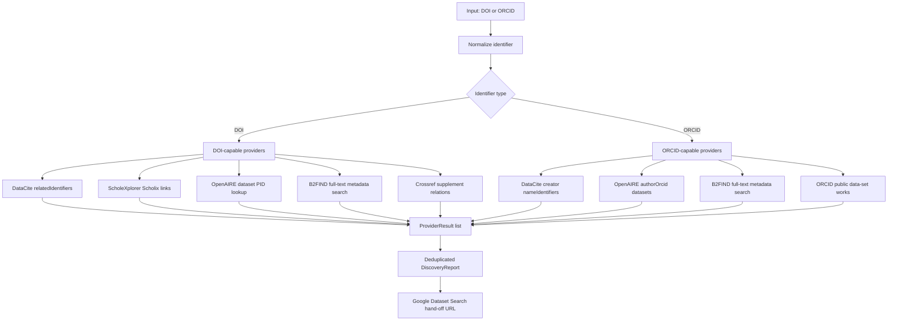

# Research Data Discovery Capabilities

This note tracks the services used by `pybman.discovery` to answer:

- Given a PuRe publication DOI, are there linked research datasets?
- Given an ORCID iD, are there public datasets by that researcher?
- Given a publication title and authors, is there a verifiable replication dataset?

The implementation is intentionally provider-based. Every provider returns a
`ProviderResult`; `DataDiscovery` merges and deduplicates `DatasetHit` objects
while preserving provider-level errors for auditability.



## Capability Matrix

| Service | API status | DOI lookup | ORCID lookup | Strength | Limitations |
| --- | --- | --- | --- | --- | --- |
| DataCite REST API | Public JSON API at `https://api.datacite.org` | `GET /dois?query=relatedIdentifiers.relatedIdentifier:"<doi>"&resource-type-id=dataset` | `GET /dois?query=creators.nameIdentifiers.nameIdentifier:*<orcid>*&resource-type-id=dataset` | Best primary source for dataset DOIs and metadata links. | Only sees DataCite DOI metadata; publication links depend on deposited related identifiers. |
| OpenAIRE Graph API | Public JSON API at `https://api.openaire.eu/graph/v1` | `GET /researchProducts?pid=<doi>&type=dataset` checks whether the DOI itself is a dataset. | `GET /researchProducts?authorOrcid=<orcid>&type=dataset` | Strong aggregated ORCID-to-dataset coverage across repositories. | Publication DOI to linked datasets is better handled by ScholeXplorer. |
| ScholeXplorer API | Public JSON Scholix API at `https://api.scholexplorer.openaire.eu/v3` | `GET /Links?sourcePid=<doi>` and `GET /Links?targetPid=<doi>` | Not supported. | Purpose-built publication-dataset relationship graph. | No author/ORCID model; source service coverage can vary over time. |
| B2FIND / EUDAT | CKAN Action API at `https://b2find.eudat.eu/api/3/action/package_search` | Full-text phrase query for the DOI. | Full-text phrase query for the ORCID iD. | Useful European repository/catalogue coverage; simple anonymous API. | No dedicated DOI/ORCID fields, so precision depends on metadata text. |
| Crossref REST API | Public JSON API at `https://api.crossref.org` | `GET /works/<doi>` and inspect dataset-like supplement relations. | Not supported for datasets. | Good high-precision publisher-asserted supplement links. | Crossref mostly registers publications; DataCite DOIs often return 404 here. |
| ORCID Public API | Public JSON API at `https://pub.orcid.org/v3.0` | Not supported for publication-to-dataset discovery. | `GET /<orcid>/works` and filter public works with type `data-set`. | Direct view of public datasets claimed on the ORCID record. | Needs public ORCID works; record completeness is researcher/source dependent. |
| Google Dataset Search | No public search API. | Manual hand-off URL generated from the DOI. | Manual hand-off URL generated from the ORCID iD or researcher name. | Helpful final human check over schema.org/Dataset-indexed pages. | Cannot be integrated as a reliable automated provider. |
| OSF API v2 | Public JSON API at `https://api.osf.io/v2` | Not used for DOI relations. | Not used for ORCID lookup. | Finds public OSF projects and registrations by title, including records without a DOI. | Candidates are only accepted after strong title and contributor matching. |
| Europe PMC REST API | Public JSON/XML API at `https://www.ebi.ac.uk/europepmc/webservices/rest` | Resolves a DOI to OA full text and extracts explicit repository links from data-availability sections; GitHub targets receive an additional repository-tree data-file audit. | Not supported. | Direct article-level evidence from the published data-availability statement. | Limited to the Europe PMC full-text corpus; future-release promises and code-only repositories are excluded. |
| PuRe full text and attachments | Public PuRe item/file APIs plus PDF text and annotation extraction. | Reads explicit data-availability statements, repository URLs, and structured supplementary files from the maintained PuRe record. | Not supported. | Uses the institutionally maintained publication context and can recover links omitted from DOI metadata. | Only public files are inspected; request-only statements and future promises are excluded. |
| AEA Data and Code | Publisher article page plus the linked openICPSR deposit. | Resolves publisher-maintained `Data and Code` links to their ICPSR DOI. | Not supported. | High-precision publisher assertion for economics replication packages. | Limited to AEA publications that expose the link in article metadata. |
| GitHub Data Repository | Authenticated GitHub code search and repository APIs. | Exact normalized publication title in README plus at least one structured data file in the repository tree. | Not supported. | Finds openly available replication repositories without deposited dataset DOI metadata. | Code/documentation-only repositories are rejected; API authentication and rate limits apply. |
| GitHub DOI data repository | Authenticated GitHub code search and repository APIs. | Publication DOI in README plus data/replication context, strong title coverage, author overlap, and structured data files. | Not supported. | Recovers official repositories whose README uses the DOI rather than the exact publication title as its main identifier. | Citation-only, code-only, manifest-only, and weak-author matches are rejected. |
| OpenAlex open-full-text fallback | Public OpenAlex work metadata plus repository/publisher PDF. | Resolves a DOI, follows only locations explicitly marked open access, then parses an actual PDF data-availability statement. | Not supported. | Extends full-text evidence beyond files attached to PuRe. | OpenAlex metadata alone never proves data availability; non-PDF and closed locations are rejected. |
| Harvard Dataverse direct search | Public Dataverse Search API. | Exact title-field query followed by strong token coverage, author overlap, published status, persistent DOI, and positive file count. | Not supported. | Finds repository records whose publication relation is absent from external DOI graphs. | Restricted to Harvard Dataverse and deliberately rejects name-only or file-less records. |
| Zenodo replication-package audit | Public Zenodo Records API plus file download. | Exact title-field query, strong title/author match, persistent DOI, then direct structured-file or ZIP-member inspection. | Not supported. | Recovers replication packages classified as software when they actually contain research data. | Archives over 50 MB and code-only packages are excluded. |
| INFORMS Management Science replication service | Official DOI-specific download form and archive. | Maps `10.1287/mnsc.*` directly to the publisher replication package, accepts the terms gate, and inspects ZIP members. | Not supported. | High-precision publisher-maintained replication files even when no repository DOI exists. | Email/terms gate is marked as an access hurdle; code- or dictionary-only archives are rejected. |
| eLife Article API | Public structured article JSON including `dataSets.availability`. | Resolves `10.7554/eLife.*` to the article record and extracts only explicit public repository links. | Not supported. | Publisher-maintained data statements avoid brittle HTML/PDF scraping. | Request-only raw data remain excluded; repository targets are audited separately for real data files. |
| PuRe same-DOI parallel records | Public PuRe Elasticsearch search and file endpoints. | Finds all PuRe records with the exact publication DOI and audits extra public data files, ZIP members, and PDF data statements. | Not supported. | Recovers files maintained by another Max Planck institute/context for the same publication. | Private/audience files, PDF-only supplements, dictionaries, and code-only archives are excluded. |
| Unpaywall open-full-text fallback | Public Unpaywall DOI metadata plus explicitly open PDF locations. | Resolves the exact DOI, downloads only HTTPS PDF targets, then parses an actual data-availability statement. | Not supported. | Complements OpenAlex when its OA-location graph misses a publisher or repository copy. | Requires a contact email; Unpaywall metadata alone never proves data availability. |
| Wiley browser evidence plus OSF audit | Read-only browser observation of the publisher's Data Availability section plus public OSF Files API. | Stores the publisher statement and exact link, then recursively requires at least one real data file at that OSF node. | Browser access may use an institutional session; OSF view-only tokens are supported. | Recovers publisher-maintained links hidden behind anti-bot protection. | Operator observation is retained as evidence; request-only, no-data, preregistration-only, and file-less links are rejected. |
| Strong publication-version propagation | Audited positive rows, PuRe record state, normalized titles, and complete author sets. | Reuses an already audited link only for identical author sets plus a near-identical title prefix, or a PuRe-withdrawn `Dublette` with substantial title overlap. | Not supported. | Connects discussion papers, renamed articles, and withdrawn duplicate records without a DOI relation. | Every propagated URL is audited again; thematic similarity or partial author overlap is insufficient. |
| Cambridge Core to OSF | Official Cambridge DOI page plus public OSF APIs. | Extracts OSF links from the DOI-resolved article page, requires publication-author overlap with OSF contributors, and recursively verifies real data files. | Not supported. | Recovers article data links exposed in Cambridge footnotes or open-practice metadata but absent from DOI graphs. | Citation-only OSF links, projects without matching contributors, protocols, and projects without structured data files are rejected. |
| De Gruyter browser evidence plus OSF audit | Read-only browser observation of the official DOI page plus public OSF APIs. | Stores the exact data-availability statement and repository DOI, then requires publication-author overlap and recursively verified data files. | Browser access may encounter the publisher WAF or article paywall; repository access is checked separately. | Preserves publisher evidence that is visible in the rendered page but unavailable to ordinary HTTP clients. | Request-only/future statements, weak author matches, and file-less projects are rejected. |
| Hugging Face exact arXiv datasets | Public Hugging Face dataset and repository APIs. | Converts an arXiv DOI to its identifier, queries the exact `arxiv:<id>` tag, and requires a public, ungated repository with actual structured data files. | Not supported. | Finds benchmark and corpus datasets whose repository metadata explicitly cites the publication but which scholarly DOI graphs do not classify as datasets. | Search-text similarity is never sufficient; private, gated, disabled, README-only, and model-only repositories are rejected. |
| OSF exact-title data-file audit | Public OSF project, contributor, and file APIs with rate-limit-aware retries. | Requires a strong title match, a publication-author surname in OSF contributor metadata, and recursively confirmed structured data files. | Not supported. | Periodically recovers newly public OSF projects even when the publication DOI is missing or repository relation graphs have not been refreshed. | File-less projects, registrations/protocols, weak title matches, and contributor-free matches are rejected. |
| Group-leader ORCID fallback | ORCID resolution by exact identity and publication overlap, then DataCite dataset matching. | Uses publication DOI/title overlap to establish the ORCID identity before matching datasets. | Resolves and queries the verified ORCID. | Recovers datasets whose metadata names the researcher but omits the publication DOI. | Accepted only with exact title or DOI evidence; name-only matches are insufficient. |
| Publisher structured supplements | Publisher metadata and attachment endpoints. | Probes publication-specific supplement records and validates actual data-file formats. | Not supported. | Can identify spreadsheets, archives, and statistical data attached directly to an article. | Publisher-specific and conservative; HTML article pages or PDF-only supplements do not count as research data. |

## Tool and Application Inventory

The following inventory is the operational map for the enrichment workflow. A
service appearing here is a discovery application or evidence source, not an
automatic assertion that research data exist. Every candidate still passes the
strict validator and final link/file audit.

### Discovery tools

| Tool | Applications and sources | Durable purpose |
| --- | --- | --- |
| `tools/research_data_enrichment/run_discovery.py` | DataCite, ScholeXplorer, OpenAIRE, B2FIND, Crossref, ORCID, OSF, Europe PMC, AEA | Runs the provider framework for DOI, title, author, and relation-graph discovery while retaining provider errors. |
| `discover_from_pure_fulltext.py` | PuRe REST/file services, PDF text and annotations | Uses institutionally maintained links, attachments, supplements, and data-availability statements. |
| `discover_pure_duplicate_files.py` | PuRe Elasticsearch and file endpoints | Searches exact-DOI parallel PuRe records and verifies additional public files and archives. |
| `discover_structured_supplements.py` | Publisher supplement endpoints | Accepts only publication-specific structured data files, not generic article or supplement pages. |
| `discover_from_openalex_fulltext.py` | OpenAlex and open-access PDFs | Extracts explicit repository links from data-availability sections in OpenAlex-indexed PDFs. |
| `discover_from_unpaywall_fulltext.py` | Unpaywall and open-access PDFs | Repeats the full-text evidence path with Unpaywall OA locations; requires `UNPAYWALL_EMAIL`. |
| `discover_elife_data.py` | eLife Article API | Reads structured publisher-maintained dataset availability and repository links. |
| `discover_cambridge_osf_data.py` | Cambridge Core, DOI resolution, OSF | Follows Cambridge article links to OSF and verifies contributor overlap and actual data files. |
| `discover_wiley_browser_evidence.py` | Wiley rendered article pages, Playwright/in-app browser, OSF | Converts recorded publisher observations into evidence only after an OSF file-tree audit. |
| `discover_degruyter_browser_evidence.py` | De Gruyter Brill rendered pages, Playwright/in-app browser, OSF | Handles publisher WAF/paywall pages through recorded browser evidence and separately verifies the repository. |
| `discover_osf_exact_title_data.py` | OSF project, contributor, and file APIs | Performs a rate-limit-aware periodic exact-title refresh and recursively confirms structured data files. |
| `discover_zenodo_replication_packages.py` | Zenodo Records API and archive downloads | Verifies long-title and exact short-title replication packages, creator overlap, and data files inside ZIP archives. |
| `discover_harvard_dataverse.py` | Harvard Dataverse Search API | Requires a published record, strong title/author evidence, persistent DOI, and a positive file count. |
| `discover_github_data_repositories.py` | GitHub code search, repository metadata, and recursive trees | Uses exact publication-title README evidence plus structured data files. |
| `discover_github_doi_repositories.py` | GitHub code search, DOI evidence, repository metadata, and recursive trees | Uses an exact publication DOI plus title/author checks and real data files; requires `GITHUB_TOKEN`. |
| `discover_huggingface_arxiv_datasets.py` | Hugging Face Datasets API and exact arXiv tags | Finds public, ungated dataset repositories that explicitly tag the publication and contain structured files. |
| `discover_informs_replication.py` | INFORMS Management Science replication service | Retrieves DOI-specific publisher packages, records the terms gate, and audits archive members. |
| `discover_by_group_orcid.py` | ORCID, DataCite, OpenAIRE, B2FIND | Resolves research-group identities through publication overlap before accepting author-linked datasets. |
| `discover_publication_versions.py` | PuRe metadata and previously audited links | Propagates evidence only between strongly identical publication versions or explicit PuRe duplicates. |

### Consolidation, audit, and report tools

| Tool | Application | Purpose |
| --- | --- | --- |
| `extract_publications.mjs` | `@oai/artifact-tool` | Extracts the source workbook into normalized `publications.json`. |
| `merge_discovery_results.py` | Discovery JSON snapshots | Merges provider results without dropping earlier successful evidence and deduplicates stable identifiers. |
| `validate_discovery_results.py` | DataCite metadata plus trusted evidence-provider rules | Rejects aggregator noise and non-dataset DOI records before network/link auditing. |
| `audit_research_data_links.mjs` | HTTP, Playwright, OSF API, GitHub API, Zenodo archives | Rechecks final URLs, access restrictions, semantic relevance, and actual repository data files. |
| `create_three_sheet_research_data_report.mjs` | `@oai/artifact-tool` and Excel `.xlsx` | Builds exactly `Übersicht`, `Forschungsdaten`, and `Forschungsgruppen`, including filters, colors, separate link columns, and access labels. |
| `verify_three_sheet_report.mjs` | `@oai/artifact-tool` render and inspect APIs | Verifies workbook structure and formula errors and renders all three sheets for visual review. |
| `build_enriched_workbook.mjs` | Legacy source-workbook enrichment | Retains the earlier workbook-in-place workflow; the three-sheet report is the current final deliverable. |
| `merge_detail_sheets.mjs`, `create_final_research_data_table.mjs` | Legacy workbook transformation | Supports the earlier merged-detail and final-table stages when reproducing historical artifacts. |
| `verify_workbook.mjs`, `verify_merged_workbook.mjs`, `verify_final_research_data_table.mjs` | Legacy workbook verification | Verifies and renders the corresponding historical workbook stages. |

### Browser and desktop applications

| Application | Use | Acceptance boundary |
| --- | --- | --- |
| Playwright | Fallback for JavaScript-heavy pages, redirects, WAF responses, paywalls, and terms/login screens. | Browser visibility alone is insufficient; the publication relationship and data files must still be independently verified. |
| Codex in-app browser | Uses an existing institutional session for read-only publisher inspection and records exact data-availability statements/links. | Observations are stored in `wiley_browser_observations.json` or `degruyter_browser_observations.json` and revalidated by code. |
| Microsoft Excel-compatible viewer | Opens the final `.xlsx` with filters, tables, colors, hyperlinks, and access-status columns. | The workbook is generated from audited JSON; manual formatting never changes the underlying `ja`/`nein` decision. |
| Git and GitHub | Versions provider code, evidence snapshots, audits, tests, and the final workbook. | Generated scratch files and previews are not authoritative and should not be committed. |

### Newly integrated applications

- **Hugging Face Datasets** adds exact `arxiv:<id>` discovery for benchmark and
  corpus repositories with file-level verification.
- **Cambridge Core** and **De Gruyter Brill** add publisher-maintained
  data-availability evidence that is subsequently checked against OSF.
- **OSF exact-title refresh** adds retry-aware periodic discovery for newly
  public deposits that have not yet reached DOI relation graphs.
- **Zenodo exact short-title matching** covers concise publication titles only
  when the normalized title core is identical, at least two authors overlap,
  and the package contains verified data files.

## Reproducible Pipeline

Use the repository virtual environment for Python tools and the bundled Codex
Node runtime for spreadsheet tools. Provider snapshots remain separate until
validation so the provenance of every hit stays inspectable.

```bash
# 1. Run or refresh individual discovery providers.
.venv/bin/python tools/research_data_enrichment/run_discovery.py \
  tools/research_data_enrichment/publications.json \
  tools/research_data_enrichment/discovery_results.json

OSF_DISCOVERY_DELAY_SECONDS=0.7 .venv/bin/python \
  tools/research_data_enrichment/discover_osf_exact_title_data.py \
  tools/research_data_enrichment/publications.json \
  tools/research_data_enrichment/discovery_results_osf_exact_title_data.json

.venv/bin/python \
  tools/research_data_enrichment/discover_zenodo_replication_packages.py \
  tools/research_data_enrichment/publications.json \
  tools/research_data_enrichment/discovery_results_zenodo_replication_verified.json

# 2. Merge all intended snapshots, then validate the merged candidates.
.venv/bin/python tools/research_data_enrichment/merge_discovery_results.py \
  <input1.json> <input2.json> <inputN.json> <merged.json>
.venv/bin/python tools/research_data_enrichment/validate_discovery_results.py \
  <merged.json> tools/research_data_enrichment/discovery_results_extended_strict.json

# 3. Audit URLs, access status, semantics, and repository files.
AUDIT_WORKERS=2 node tools/research_data_enrichment/audit_research_data_links.mjs \
  tools/research_data_enrichment/publications.json \
  tools/research_data_enrichment/discovery_results_extended_strict.json \
  tools/research_data_enrichment/audited_research_data.json

# 4. Build and verify the final three-sheet workbook.
node tools/research_data_enrichment/create_three_sheet_research_data_report.mjs \
  tools/research_data_enrichment/publications.json \
  tools/research_data_enrichment/audited_research_data.json \
  outputs/research_data_enrichment/Forschungsdaten_2024-heute_3_Sheets_konsolidiert_geprueft.xlsx
node tools/research_data_enrichment/verify_three_sheet_report.mjs \
  outputs/research_data_enrichment/Forschungsdaten_2024-heute_3_Sheets_konsolidiert_geprueft.xlsx \
  /tmp/research_data_previews
```

Relevant optional environment variables are `GITHUB_TOKEN`, `UNPAYWALL_EMAIL`,
`DISCOVERY_WORKERS`, `DISCOVERY_DISABLE_PROVIDERS`,
`OSF_DISCOVERY_DELAY_SECONDS`, and `AUDIT_WORKERS`. An OpenAIRE access token can
also be supplied through the `DataDiscovery` Python API. Credentials must never
be written to result snapshots or committed files.

`DataDiscovery.for_title(...)` provides a high-precision title fallback through
DataCite and OSF. Both providers only retain records with a strong normalized
title match and at least one matching author surname. This finds replication
packages whose repository metadata names the publication but omits its DOI, and
it also works for DOI-less PuRe records.

## Report-grade definition and audit rule

A publication is marked `Ja` only when at least one persistent or maintained
landing page points to concrete digital research data used, collected,
generated, or compiled for the reported study. Accepted objects include raw or
processed observations, survey or experimental data, coded corpora, analysis
datasets, simulation inputs/outputs, and replication packages containing such
data. Code alone, protocols, questionnaires without responses, articles,
presentations, bibliographies, and generic project pages without data files are
not research data.

Every accepted link must satisfy both provenance and availability checks:

- the relation to the publication is explicit in PuRe, publisher metadata, a
  data-availability statement, repository metadata, an exact-title README, or
  a verified publication/author identifier;
- the URL resolves to the maintained dataset landing page or a concrete public
  data file; redirects are followed and malformed or missing targets fail;
- authoritative repository responses `401`, `402`, or `403` may be retained
  only when the dataset identity and publication relation are independently
  verified; the workbook then marks `Paywall/Login oder Zugriffsschutz`;
- `available on request`, planned/future release, incomplete view tokens, and
  unverified search-result URLs are always recorded as `Nein`.

Exact normalized-title and strong-author-overlap propagation is allowed only
between duplicate PuRe records of the same publication. The originating audited
record remains recorded as evidence.

## Similar Services Considered

| Service | API | Decision |
| --- | --- | --- |
| Zenodo | Public REST API supports searching published records and files. | Integrated as a conservative replication-package fallback with title/author matching and archive-level data-file inspection. |
| Figshare | Public API exists. | Same pattern as Zenodo: useful repository-specific fallback, but DataCite/OpenAIRE already cover many records. |
| Dryad | Public API exists. | Candidate for future repository-specific fallback; current generic providers should find DOI-linked Dryad datasets via DataCite/Crossref/ScholeXplorer. |
| DataCite Commons | Web UI on top of DataCite graph data. | Use DataCite REST API directly for automation. |
| ORKG / Wikidata / OpenCitations | APIs exist. | Useful for broader scholarly graph enrichment, but not primary evidence for "research data exist for this DOI/ORCID". |

## Implementation Notes

- DOI and ORCID values are normalized before provider calls to make query
  construction deterministic and deduplication reliable.
- Provider failures are captured in `ProviderResult.error`; a timeout or API
  outage does not fail the whole lookup.
- Tests mock all HTTP requests with `responses`. Optional live tests are
  guarded by `PYBMAN_LIVE_TESTS=1`.
- Google Dataset Search is exposed as `google_dataset_search_url(query)` only,
  because there is no public API contract to test against.

## Verified API References

- DataCite query/filter parameters:
  <https://support.datacite.org/docs/api-queries>
- OpenAIRE Graph API:
  <https://graph.openaire.eu/docs/apis/graph-api/>
- OpenAIRE research-product search:
  <https://graph.openaire.eu/docs/apis/search-api/research-products/>
- ScholeXplorer API:
  <https://graph.openaire.eu/docs/apis/scholexplorer/api/>
- CKAN package search used by B2FIND:
  <https://docs.ckan.org/en/latest/api/index.html#ckan.logic.action.get.package_search>
- ORCID Public API:
  <https://info.orcid.org/what-is-orcid/services/public-api/>
- ORCID record reading tutorial:
  <https://info.orcid.org/documentation/api-tutorials/api-tutorial-read-data-on-a-record/>
- Zenodo REST API:
  <https://developers.zenodo.org/>
- Zenodo search guide:
  <https://help.zenodo.org/guides/search/>
