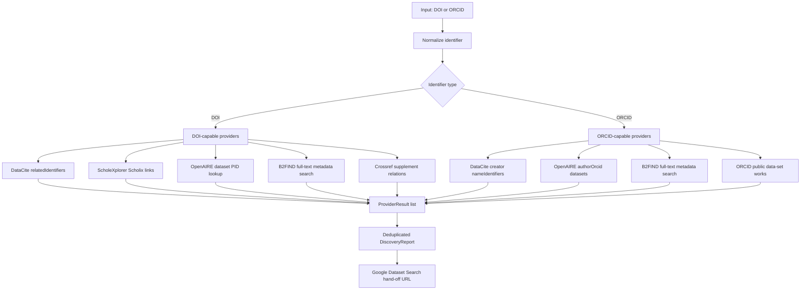

# Research Data Discovery Capabilities

This note tracks the services used by `pybman.discovery` to answer:

- Given a PuRe publication DOI, are there linked research datasets?
- Given an ORCID iD, are there public datasets by that researcher?

The implementation is intentionally provider-based. Every provider returns a
`ProviderResult`; `DataDiscovery` merges and deduplicates `DatasetHit` objects
while preserving provider-level errors for auditability.

## Capability Matrix

| Service | API status | DOI lookup | ORCID lookup | Strength | Limitations |
| --- | --- | --- | --- | --- | --- |
| DataCite REST API | Public JSON API at `https://api.datacite.org` | `GET /dois?query=relatedIdentifiers.relatedIdentifier:"<doi>"&resource-type-id=dataset` | `GET /dois?query=creators.nameIdentifiers.nameIdentifier:*<orcid>*&resource-type-id=dataset` | Best primary source for dataset DOIs and metadata links. | Only sees DataCite DOI metadata; publication links depend on deposited related identifiers. |
| OpenAIRE Graph API | Public JSON API at `https://api.openaire.eu/graph/v1` | `GET /researchProducts?pid=<doi>&type=dataset` checks whether the DOI itself is a dataset. | `GET /researchProducts?authorOrcid=<orcid>&type=dataset` | Strong aggregated ORCID-to-dataset coverage across repositories. | Publication DOI to linked datasets is better handled by ScholeXplorer. |
| ScholeXplorer API | Public JSON Scholix API at `https://api.scholexplorer.openaire.eu/v3` | `GET /Links?sourcePid=<doi>` and `GET /Links?targetPid=<doi>` | Not supported. | Purpose-built publication-dataset relationship graph. | No author/ORCID model; source service coverage can vary over time. |
| B2FIND / EUDAT | CKAN Action API at `https://b2find.eudat.eu/api/3/action/package_search` | Full-text phrase query for the DOI. | Full-text phrase query for the ORCID iD. | Useful European repository/catalogue coverage; simple anonymous API. | No dedicated DOI/ORCID fields, so precision depends on metadata text. |
| Crossref REST API | Public JSON API at `https://api.crossref.org` | `GET /works/<doi>` and inspect dataset-like supplement relations. | Not supported for datasets. | Good high-precision publisher-asserted supplement links. | Crossref mostly registers publications; DataCite DOIs often return 404 here. |
| ORCID Public API | Public JSON API at `https://pub.orcid.org/v3.0` | Not supported for publication-to-dataset discovery. | `GET /<orcid>/works` and filter public works with type `data-set`. | Direct view of public datasets claimed on the ORCID record. | Needs public ORCID works; record completeness is researcher/source dependent. |
| Google Dataset Search | No public search API. | Manual hand-off URL generated from the DOI. | Manual hand-off URL generated from the ORCID iD or researcher name. | Helpful final human check over schema.org/Dataset-indexed pages. | Cannot be integrated as a reliable automated provider. |

## Similar Services Considered

| Service | API | Decision |
| --- | --- | --- |
| Zenodo | Public REST API supports searching published records and files. | Not a default provider yet because most Zenodo records are already indexed through DataCite/OpenAIRE; add later if repository-specific recall is needed. |
| Figshare | Public API exists. | Same pattern as Zenodo: useful repository-specific fallback, but DataCite/OpenAIRE already cover many records. |
| Dryad | Public API exists. | Candidate for future repository-specific fallback; current generic providers should find DOI-linked Dryad datasets via DataCite/Crossref/ScholeXplorer. |
| DataCite Commons | Web UI on top of DataCite graph data. | Use DataCite REST API directly for automation. |
| ORKG / Wikidata / OpenCitations | APIs exist. | Useful for broader scholarly graph enrichment, but not primary evidence for "research data exist for this DOI/ORCID". |

## Implementation Notes

- DOI and ORCID values are normalized before provider calls to make query
  construction deterministic and deduplication reliable.
- Provider failures are captured in `ProviderResult.error`; a timeout or API
  outage does not fail the whole lookup.
- Tests mock all HTTP requests with `responses`. Optional live tests are
  guarded by `PYBMAN_LIVE_TESTS=1`.
- Google Dataset Search is exposed as `google_dataset_search_url(query)` only,
  because there is no public API contract to test against.

## Verified API References

- DataCite query/filter parameters:
  <https://support.datacite.org/docs/api-queries>
- OpenAIRE Graph API:
  <https://graph.openaire.eu/docs/apis/graph-api/>
- OpenAIRE research-product search:
  <https://graph.openaire.eu/docs/apis/search-api/research-products/>
- ScholeXplorer API:
  <https://graph.openaire.eu/docs/apis/scholexplorer/api/>
- CKAN package search used by B2FIND:
  <https://docs.ckan.org/en/latest/api/index.html#ckan.logic.action.get.package_search>
- ORCID Public API:
  <https://info.orcid.org/what-is-orcid/services/public-api/>
- ORCID record reading tutorial:
  <https://info.orcid.org/documentation/api-tutorials/api-tutorial-read-data-on-a-record/>
- Zenodo REST API:
  <https://developers.zenodo.org/>
- Zenodo search guide:
  <https://help.zenodo.org/guides/search/>
